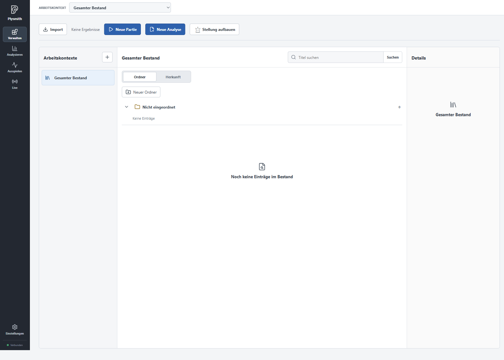
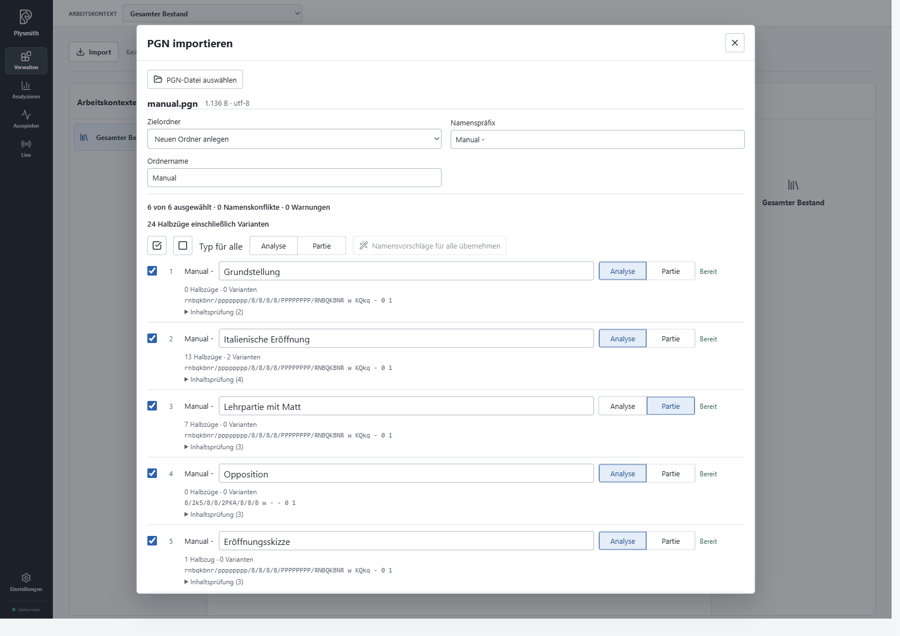

# Beispielbestand importieren

Mit dem [Beispielbestand `manual.pgn`](manual.pgn) können Sie die folgenden Schritte selbst nachvollziehen. Der Import legt sechs Einträge an. Im nächsten Kapitel wählen Sie daraus das Material aus, mit dem Sie weiterarbeiten möchten.

## Datei auswählen

Öffnen Sie **Verwalten** und wählen Sie oben **Gesamter Bestand**. In einer neu eingerichteten App ist dieser Bereich noch leer.

Klicken Sie auf **Import**, anschließend auf **PGN-Datei auswählen**, und wählen Sie `manual.pgn`. Plysmith liest die Datei ein und zeigt eine Vorschau. Noch ist keiner dieser Inhalte in Ihrem Bestand gespeichert.

## Auswahl und Namen prüfen

Für unser Beispiel lassen Sie alle sechs Kapitel ausgewählt. Legen Sie unter **Zielordner** einen neuen Ordner mit dem **Ordnernamen** `Manual` an. Ersetzen Sie das vorgeschlagene **Namenspräfix** durch `Manual - `, einschließlich des Leerzeichens nach dem Bindestrich. Damit erhält beispielsweise das Kapitel „Italienische Eröffnung“ den vollständigen Namen „Manual - Italienische Eröffnung“.

Wählen Sie für „Lehrpartie mit Matt“ ausdrücklich **Partie**. Die übrigen fünf Kapitel bleiben **Analyse**. Die Lehrpartie ist ein konstruiertes Beispiel: Wir übernehmen ihre Zugfolge hier bewusst als unveränderlichen Beispielverlauf, um später die unterschiedlichen Arbeitsweisen an Partie und Analyse zu zeigen.

Die Vorschau nennt zu jedem Kapitel die Zahl der Halbzüge und Varianten. **Inhaltsprüfung** öffnet die Hinweise dazu, was erhalten bleibt, angepasst oder nicht übernommen wird. Auch eine Analyse ohne Züge ist ein gültiger Eintrag, wie „Grundstellung“ und „Opposition“ zeigen.

## Import abschließen

Prüfen Sie, dass sechs Kapitel ausgewählt sind und keine Namenskonflikte bestehen. Klicken Sie auf **Auswahl importieren**. Nach der Erfolgsmeldung schließen Sie den Dialog.

Unter **Verwalten** finden Sie jetzt den Ordner **Manual**. Klappen Sie ihn auf. Er enthält:

- Manual - Grundstellung
- Manual - Italienische Eröffnung
- Manual - Lehrpartie mit Matt
- Manual - Opposition
- Manual - Eröffnungsskizze
- Manual - Entwicklungsskizze

Sie haben damit fünf Analysen und eine Partie im Bestand. Die Reihenfolge der Kapitel aus der Datei bleibt beim Import erhalten.

## Andere PGN-Dateien übernehmen

Plysmith importiert lokale PGN-Dateien für Standardschach. Laden Sie Material
von einer Webseite zuerst herunter; ein ZIP-Archiv müssen Sie vor dem Import
entpacken. Anregungen mit Downloadlinks und Hinweisen zum Material finden Sie
im [Quellenkatalog](../import-sources.md).

Bei eigenen Dateien wählen Sie gezielt die Kapitel aus, die Sie bearbeiten möchten. Entfernen Sie dafür die Häkchen bei den übrigen Einträgen. Den Typ können Sie je Kapitel oder über **Typ für alle** festlegen. Ein Ergebnis in der PGN-Datei bestimmt den Typ nicht automatisch.

Ein Namenskonflikt bedeutet, dass der vollständige Name bereits vergeben ist. Bearbeiten Sie den Kapitelnamen oder das gemeinsame Präfix. Sie können auch die angebotenen Namensvorschläge übernehmen. Namen gelten für den gesamten Bestand, unabhängig von Ordner und Typ; eine andere Groß- oder Kleinschreibung reicht nicht aus. Unverständliche Titel aus der Quelldatei können Sie bereits hier durch aussagekräftige Namen ersetzen.

Prüfen Sie angezeigte Warnungen, bevor Sie deren Bestätigung setzen. Als **Abgelehnt** markierte Kapitel können nicht übernommen werden. Falls Plysmith die Auswahl als zu groß meldet, wählen Sie weniger Kapitel. Bei einer Datei mit älterer Zeichenkodierung kann die App **Erneut als ISO-8859-1 einlesen** anbieten; kontrollieren Sie anschließend insbesondere die Namen und Umlaute.

Plysmith kann auch zu große Quelldateien, Dateien mit zu vielen Kapiteln oder
besonders umfangreiche einzelne Kapitel ablehnen. Scheitert bereits das
Einlesen, verwenden Sie eine kleinere PGN-Datei; eine geringere Auswahl in
der Vorschau hilft erst nach erfolgreichem Einlesen.

Hauptlinie und Varianten bleiben erhalten. PGN-Kommentare und nützliche Angaben
wie Spieler, Eröffnung oder Ergebnis werden als bearbeitbare Notizen übernommen;
Angaben an derselben Stellung stehen zusammen in einer Notiz. Technische Angaben
zu Uhren, Bewertungen oder grafischen Markierungen sowie Bewertungszeichen
werden nicht übernommen. Die Inhaltsprüfung weist auf diese Unterschiede hin.

**Auswahl importieren** legt neue Einträge im Gesamten Bestand an; vorhandene
Einträge werden weder ersetzt noch zusammengeführt. Ein erneuter Import mit
anderen Namen erzeugt zusätzliche Einträge. Schließen Sie die Vorschau oder
starten Sie Plysmith neu, wird die noch nicht importierte Auswahl verworfen,
ohne den Bestand zu verändern.

[Zur Übersicht](README.md) · Weiter mit [Bestand sichten und ordnen](02-inventory.md).
