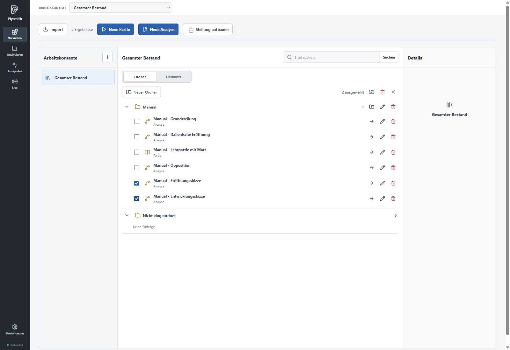
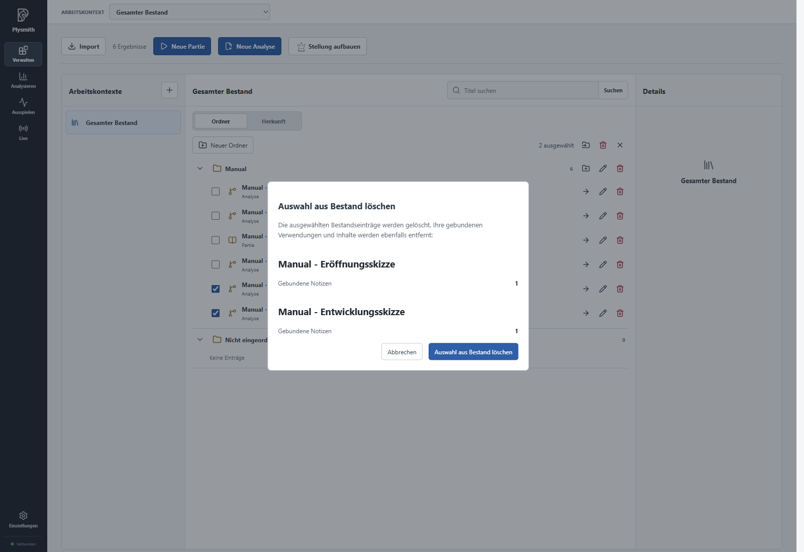

# Reviewing and organising your inventory

After the import, the **Manual** folder contains six entries. In this chapter, you will examine the material and remove the two sketches that are not needed for the remaining exercises.

> The screenshots show the German UI; instructions use its English labels. Sample names stay as they appear in the PGN. See the [language and notation note](README.en.md).

## Selecting or opening an entry

In **Manage**, click the name "Manual - Italienische Eröffnung". Its **Details** appear on the right, with a board preview and move sequence.

In this preview, you can click moves or step through them with the arrows. Use the branching icons to expand existing variations. This gives you an idea of the content before exploring it further.

The **Analyse** arrow in the row opens the entry on the analysis board. Clicking the name only selects its details. The checkbox on the left has a different purpose: it adds the entry to a selection for actions on multiple entries.

## Finding an entry

Entries appear in ascending order of creation. Imported chapters follow their order in the PGN file; later edits or moves between folders do not change this order.

For example, enter `Italienische` in **Search titles** and click **Search**. For the following exercises, clear the search field afterwards and search again so all entries are visible.

The pencil icon **Rename** changes an entry's title. You can also edit its **Description** in the form. Check the new name and save the change. For these exercises, keep the imported names for now so the examples remain easy to find.

A name must be unique across the entire inventory. This also applies when the other entry is in a different folder or has a different type. If there is a conflict, choose your own name or select **Use suggestion**.

## Organising with folders

The **Folders** view shows your organisation by topic. Use **New folder** to create a folder; an existing folder's actions let you rename it or **Create subfolder**.

To move entries, select one or more using their checkboxes. Under **Actions for selection**, choose **Move selection to folder**, select the destination folder and confirm. **Unfiled** is also a possible destination. Moving creates no copies and changes neither move sequences nor notes.

Alternatively, drag an entry onto the destination folder. Dragging a checked entry moves the entire current selection. You can also drag a folder into another folder.

If an action on multiple entries only partially succeeds, the entries not yet processed remain selected. This lets you continue with those entries specifically.

Folders and entries are deleted separately. **Delete folder and subfolders** removes the folder structure; its games and analyses remain under **Unfiled**. **Delete from inventory**, by contrast, removes the content itself. Pay attention to the name and preview of the action you choose.

## Removing the two sketches together

"Eröffnungsskizze" and "Entwicklungsskizze" overlap with the other material. They are saved analyses, but we do not need them for the rest of this manual.

1. Select only "Manual - Eröffnungsskizze" and "Manual - Entwicklungsskizze" using their checkboxes. The selection shows **2 selected**.
2. Choose **Delete selection from inventory** in the selection actions.
3. Check both names and the listed consequences. The sketches already have imported notes; these belong to the entries and will be removed with them.
4. Confirm **Delete selection from inventory**.

Four entries remain: **Grundstellung**, **Italienische Eröffnung**, **Lehrpartie mit Matt** and **Opposition**, each with the prefix `Manual - `. These four are the starting point for the following chapters.

The loss preview also matters when deleting entries later. An entry may by then have your own notes, analysis paths or uses in working contexts. Derived entries already saved independently remain when their source is deleted. Still, check the consequences listed each time before confirming.

## Viewing by origin

The **Origins** switch shows connections between entries created by derivation. Initially, the six imported chapters had no such connections to each other: they came from the same file but were independent pieces of content.

In the next chapter, you will save a separate analysis, "Manual - Italienisch mit d6", from the Italian opening. You can then switch to **Origins** here and expand its provenance family. This lets you find the investigation alongside its source, even if you later move it to another folder.

**Folders** therefore answers how you organise your material by topic. **Origins** shows where a separate investigation came from. Both views lead to the same inventory entries.

[Back to overview](README.en.md). Next: [Investigating positions and recording your thoughts](03-analysis.en.md).
