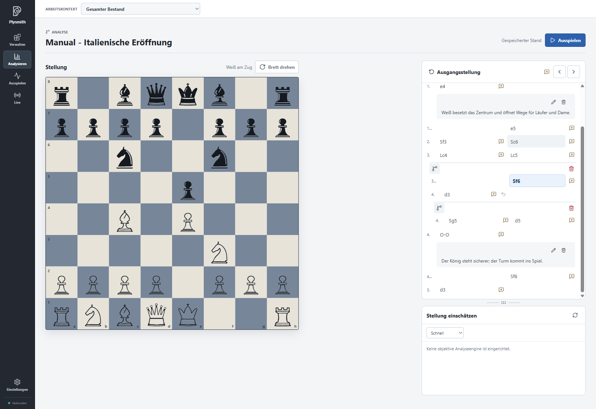
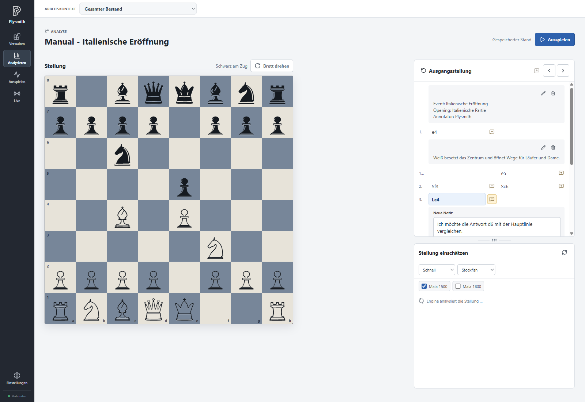
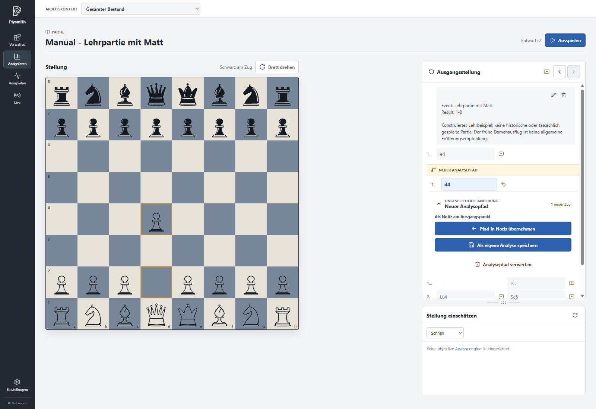
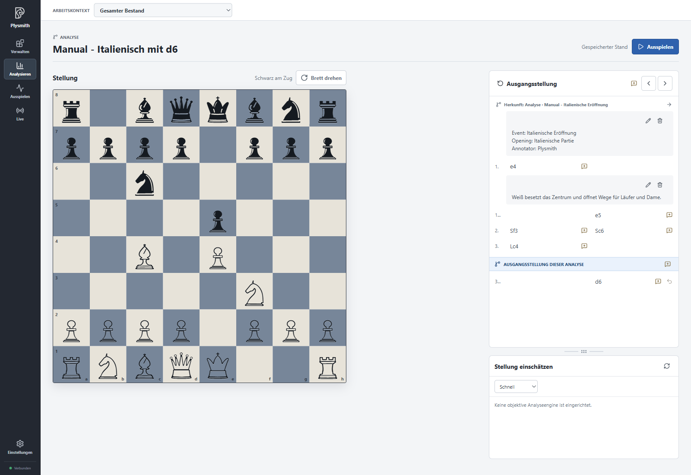
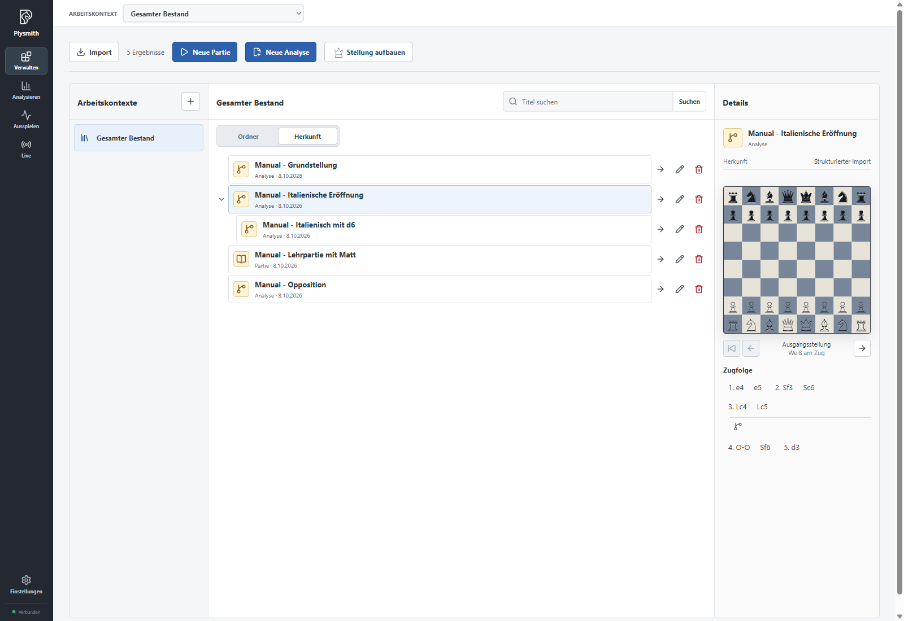
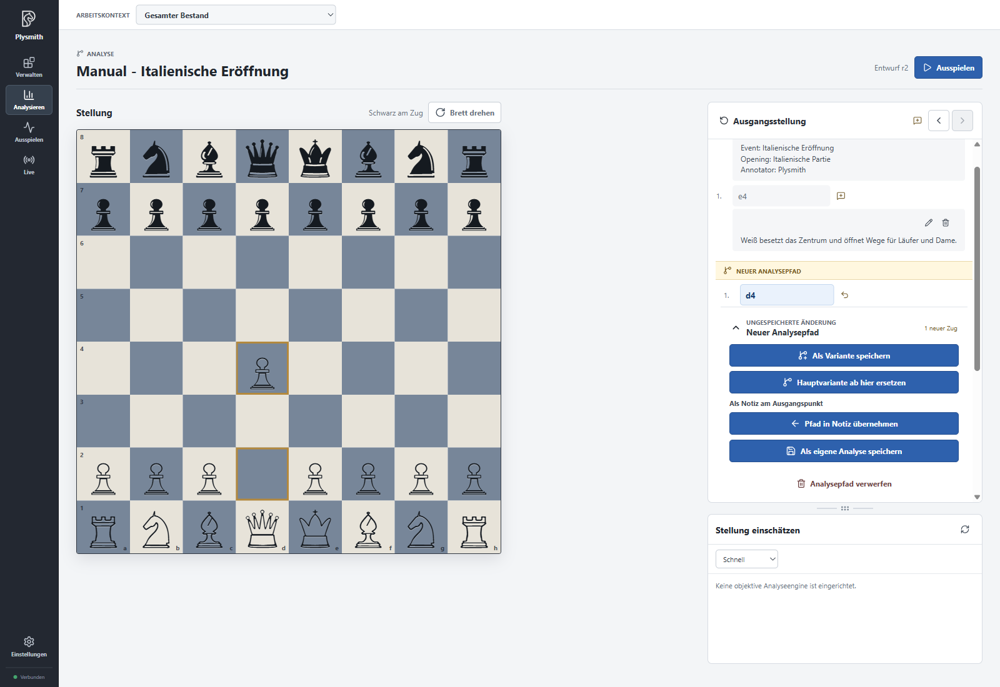
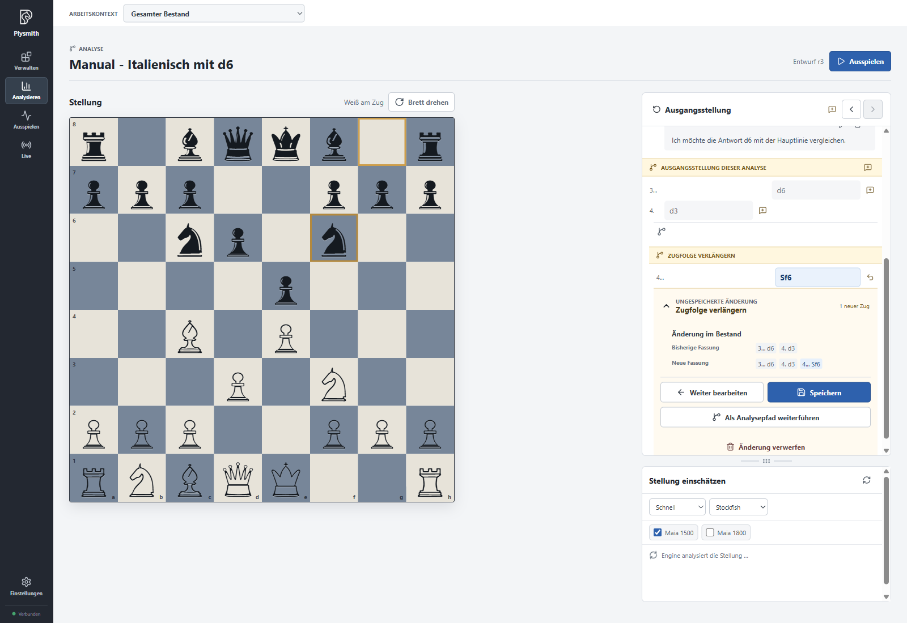
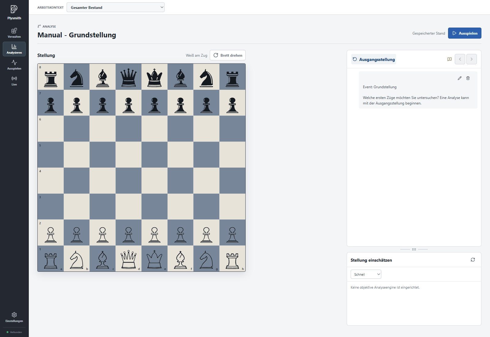
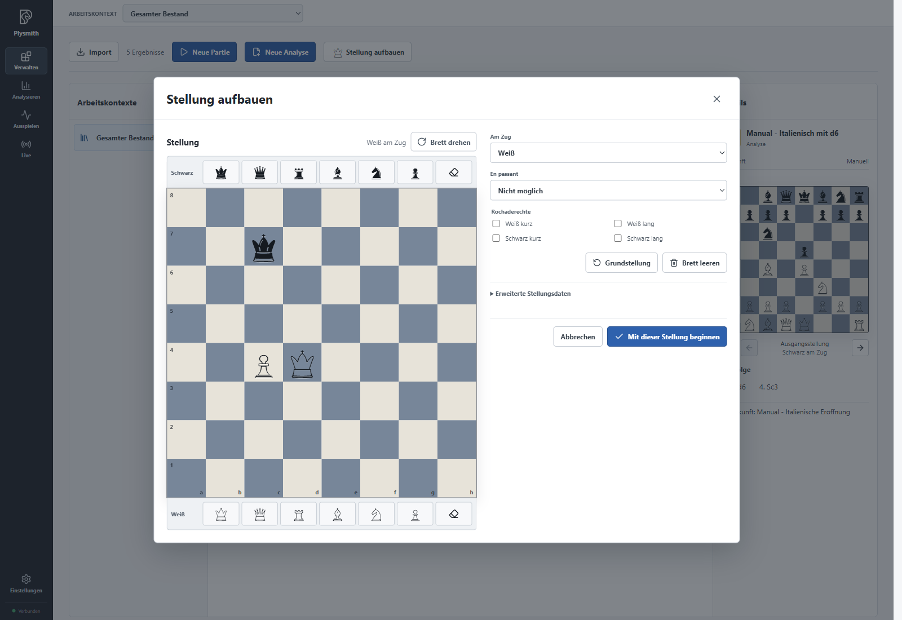

# Stellungen untersuchen und Gedanken festhalten

Öffnen Sie in **Verwalten** die Analyse „Manual - Italienische Eröffnung“ über den Pfeil **Analysieren**. Sie benötigen zunächst keine Engine: Die folgenden Schritte zeigen, wie Sie selbst Fortsetzungen untersuchen und Ihre Arbeit festhalten.

## Durch Züge und Varianten gehen

Links steht das Brett, rechts die Zugfolge. Klicken Sie auf **3.Lc4**. Das Brett zeigt die Stellung nach diesem Halbzug. Die Pfeile **Einen Zug zurück** und **Einen Zug vor** führen Sie durch den gewählten Verlauf. Mit **Ausgangsstellung** springen Sie an dessen Anfang.

Klappen Sie die Variante **3…Sf6** am Verzweigungssymbol auf und wählen Sie ihren ersten Zug. Sie können nun dieser Fortsetzung folgen. Innerhalb der Variante gibt es mit **4.Sg5** eine weitere Alternative zu **4.d3**. Klappen Sie auch diese Verzweigung auf, wenn Sie sie ansehen möchten. Durch einen Klick auf **3…Lc5** in der Hauptlinie kehren Sie zum Hauptverlauf zurück.

Die Pfeile folgen dem gewählten Verlauf; sie gehen nicht einfach von oben nach unten durch alle sichtbaren Varianten. Das Ein- und Ausklappen verändert nur die Darstellung. **Brett drehen** wechselt die Blickrichtung, ohne Stellung oder Zugfolge zu verändern.

Wenn unter der Zugfolge Enginebewertungen angezeigt werden, können Sie den Platz zwischen beiden Bereichen am Griff anpassen. Wie Sie Engines einrichten und deren Angaben lesen, folgt im Kapitel zu den Einstellungen und Engines.

## Notizen ergänzen und bearbeiten

Wählen Sie in der italienischen Eröffnung **1.e4**. Dort steht bereits die importierte Notiz über das Zentrum. Über ihren Stift **Notiz bearbeiten** können Sie den Text ergänzen. Fügen Sie beispielsweise „Welche Antwort von Schwarz möchte ich genauer untersuchen?“ hinzu und wählen Sie **Notiz speichern**.

Für einen neuen Gedanken wählen Sie **3.Lc4** und klicken auf das Sprechblasensymbol mit Plus an diesem Halbzug. Schreiben Sie etwa „Ich möchte die Antwort d6 mit der Hauptlinie vergleichen.“ und speichern Sie die Notiz. Sie gehört jetzt zu diesem Halbzug. Im **Gesamten Bestand** trägt sie die Sichtbarkeit **Allgemein**.

Über das Sprechblasensymbol neben **Ausgangsstellung** können Sie einen Gedanken zum Beginn festhalten. Vorhandene Notizen lassen sich mit ihrem Papierkorbsymbol löschen; die App verlangt dafür eine Bestätigung. Das Löschen einer Notiz verändert die gespeicherten Züge nicht.

## Eine Fortsetzung auf dem Brett ausprobieren

Wechseln Sie über **Verwalten** zu „Manual - Lehrpartie mit Matt“ und öffnen Sie sie zum Analysieren. Klicken Sie auf **Ausgangsstellung**. Klicken Sie zuerst den weißen Bauern auf d2 und dann das Zielfeld d4 an.

Unter **Neuer Analysepfad** erscheint **Ungespeicherte Änderung**. Sie haben eine eigene Fortsetzung begonnen. Der gespeicherte Verlauf der Lehrpartie bleibt erhalten. Öffnen Sie die zugehörigen Möglichkeiten über **Änderung prüfen…** oder die aufklappbare Überschrift des Pfads.

Plysmith merkt sich den vorläufigen Pfad auch über einen Neustart hinweg. Entscheiden Sie dennoch bewusst, wie Sie ihn abschließen möchten. Mit **Analysepfad verwerfen** beenden Sie die Untersuchung ohne Übernahme.

Am Ende eines Analysepfads können Sie mit dem gebogenen Pfeil **Letzten Zug zurücknehmen** den zuletzt gespielten Halbzug zurücknehmen. Bei einem längeren Pfad bleiben die vorangegangenen Züge erhalten. Nehmen Sie auch den letzten verbleibenden Halbzug zurück, verschwindet der Analysepfad und Sie sind wieder an seinem Ausgangspunkt. Der gespeicherte Verlauf bleibt unverändert.

Sie können den Zug auch direkt auf dem Brett zurücknehmen: Klicken Sie auf die zuletzt bewegte Figur und anschließend auf ihr vorheriges Feld. Für **1.d4** klicken Sie also auf den Bauern auf **d4** und dann auf **d2**. So können Sie Fortsetzungen ausprobieren und Figuren wieder zurücksetzen, wie beim Analysieren an einem richtigen Schachbrett. Wenn Sie die Rücknahme ausprobieren, spielen Sie anschließend erneut **1.d4**, damit Sie diesen Pfad im nächsten Schritt als Notiz übernehmen können.

### Als Notiz übernehmen

Für den gerade ausprobierten Zug **1.d4** wählen Sie **Pfad in Notiz übernehmen**. Die Zugfolge steht nun im Notizentwurf. Ergänzen Sie „Alternative zum Beginn der Lehrpartie“ und klicken Sie auf **Notiz speichern**.

Die Fortsetzung ist danach als bearbeitbare Notiz am Ausgangspunkt festgehalten. Es entsteht weder eine neue Partie noch eine Variante im gespielten Verlauf. Öffnen Sie die Notiz später erneut, wenn Sie ihren Text ändern möchten.

### Als eigene Analyse speichern

Öffnen Sie wieder „Manual - Italienische Eröffnung“ und wählen Sie **3.Lc4**. Spielen Sie auf dem Brett **3…d6**, indem Sie den schwarzen Bauern auf d7 und anschließend d6 anklicken. Öffnen Sie die Möglichkeiten des neuen Analysepfads und wählen Sie **Als eigene Analyse speichern**.

Tragen Sie als **Titel** `Manual - Italienisch mit d6` ein. Wählen Sie bei **Ablage** den Ordner **Manual** oder **Ordner des Ursprungs**. Bestätigen Sie **Analyse speichern**. Diese eigene Analyse dient im weiteren Verlauf als Arbeitsanalyse.

Die neue Analyse beginnt nach **3.Lc4**. Die blaue Grenze **Ausgangsstellung dieser Analyse** trennt den angezeigten Quellverlauf von den eigenen Zügen. **3…d6** ist zunächst ihr einziger eigener Zug. Die Züge davor erklären die Herkunft; Sie haben sie nicht als eigene Hauptlinie kopiert.

Klicken Sie auf **Ausgangsstellung dieser Analyse**, um an ihren eigenen Anfang zu gehen. **Ausgangsstellung** oben über der Zugfolge zeigt dagegen den Anfang des Herkunftsverlaufs. Dort können Sie die Quellstellung ansehen, aber keine eigene Fortsetzung auf dem Brett beginnen.

Unter **Verwalten** finden Sie nun einen zusätzlichen Eintrag. In der Ansicht **Herkunft** gehört er zur italienischen Eröffnung. Die Quelle bleibt eigenständig erhalten und ihre Hauptlinie ist unverändert. Spätere Änderungen an einer der beiden Analysen werden nicht automatisch in die andere übernommen.

### Als Variante in derselben Analyse speichern

Eine Variante probieren Sie gleich an der neuen Arbeitsanalyse aus. So bleibt die gespeicherte Zugstruktur des importierten Beispiels für die späteren Kapitel erhalten.

Öffnen Sie „Manual - Italienisch mit d6“, wählen Sie **3…d6** und spielen Sie **4.d3**. Öffnen Sie **Änderung prüfen…**, wählen Sie **Zugfolge verlängern**, prüfen Sie die Vorschau und bestätigen Sie **Speichern**. Die eigene Hauptlinie besteht jetzt aus **3…d6 4.d3**.

Wählen Sie wieder **3…d6** und probieren Sie stattdessen **4.Sc3**. Diesmal wählen Sie beim Analysepfad **Als Variante speichern**. Prüfen Sie die angezeigte Fortsetzung und bestätigen Sie **Speichern**. **4.d3** bleibt die Hauptfortsetzung; **4.Sc3** steht als aufklappbare Alternative daneben. Es entsteht kein weiterer Bestandseintrag.

Bei der Übernahme können Sie zusätzlich **Zugfolge auch als Kommentar speichern** wählen und den Kommentar bearbeiten. Für diese Übung lassen Sie die Option ausgeschaltet: Die neue Variante selbst enthält bereits die Fortsetzung.

Das Bild zeigt dieselben Übernahmemöglichkeiten an der importierten italienischen Analyse mit einem Pfad ab der Grundstellung. An der Arbeitsanalyse wählen Sie entsprechend **Als Variante speichern**. Bei einer **Partie** wird diese Möglichkeit nicht angeboten, weil ihre gespeicherten Züge den gespielten Verlauf festhalten.

## Die Hauptlinie gezielt bearbeiten

Bleiben Sie für alle folgenden Änderungen in **Manual - Italienisch mit d6**. Jeder Schritt endet mit dem Speichern; der nächste baut auf dem so entstandenen Stand auf.

### Verlängern

Wählen Sie **4.d3** in der Hauptlinie und spielen Sie **4…Sf6**. Öffnen Sie **Änderung prüfen…** und wählen Sie **Zugfolge verlängern**. In der Vorschau sehen Sie die bisherige und die neue Fassung. Prüfen Sie, dass nur **4…Sf6** hinzukommt, und wählen Sie **Speichern**.

### Kürzen

Wählen Sie den letzten Hauptlinienzug **4…Sf6** und klicken Sie auf **Letzten Zug zurücknehmen**, den gebogenen Pfeil an diesem Zug. Plysmith bereitet **Zugfolge kürzen** vor. Prüfen Sie in der Vorschau, dass **4…Sf6** entfällt und **4.d3** der letzte Hauptlinienzug bleibt. Bestätigen Sie **Speichern**.

Das unterscheidet sich vom linken Navigationspfeil: Dieser zeigt nur eine frühere Stellung. **Letzten Zug zurücknehmen** bereitet bei einer gespeicherten Analyse eine Änderung der Zugfolge vor.

### Eine Variante entfernen

Klappen Sie die Variante **4.Sc3** auf. Wählen Sie an ihrem Verzweigungskopf den Papierkorb **Variante löschen**. Prüfen Sie die entfallende Fortsetzung und bestätigen Sie die Änderung mit **Speichern**. Die Hauptlinie **3…d6 4.d3** bleibt bestehen.

Bei einer längeren Variante werden auch ihre nachfolgenden Züge und darin liegenden Abzweigungen entfernt. Betroffene Notizen werden in der Vorschau genannt. Das bloße Einklappen über das Verzweigungssymbol entfernt dagegen nichts.

### Eine Fortsetzung ersetzen

Wählen Sie wieder **3…d6** und spielen Sie **4.Sc3**. Entscheiden Sie sich diesmal für **Hauptvariante ab hier ersetzen**. Prüfen Sie, dass die neue Fassung **4.Sc3** anstelle von **4.d3** enthält, und wählen Sie **Speichern**.

Die Arbeitsanalyse hat damit die eigene Hauptlinie **3…d6 4.Sc3**. Die ursprüngliche italienische Eröffnung wurde bei keinem dieser Schritte verändert.

Vor Änderungen prüft Plysmith auch, ob Notizen oder andere Arbeitsstände betroffen sind. Eine Meldung über eine Notiz in der bisherigen Fassung bedeutet, dass deren Bezug nicht unverändert in die neue Fassung passt. Lesen Sie die konkreten Folgen. Mit **Weiter bearbeiten** können Sie zur Vorbereitung zurückkehren; Sie müssen eine Vorschau nicht sofort speichern. Auswirkungen auf Arbeitskontexte werden im abschließenden Kontextkapitel behandelt.

## Eine neue Analyse ohne Quelle beginnen

Sie können auch unabhängig von einem vorhandenen Eintrag beginnen. Wählen Sie in **Verwalten** **Neue Analyse**, um von der Grundstellung aus zu arbeiten. Sie können bereits die Ausgangsstellung ohne einen einzigen Zug über **Als eigene Analyse speichern** festhalten. Vergeben Sie dafür einen neuen, eindeutigen Titel.

Das Bild zeigt „Manual - Grundstellung“, die schon durch den Import entstanden ist. Ein zusätzlicher Eintrag ist für die Übungen nicht erforderlich. Die Möglichkeit, ohne Züge anzufangen, wird später beim Aufbau einer Eröffnungsbibliothek wieder nützlich.

Für eine andere Ausgangsstellung wählen Sie **Stellung aufbauen**. Mit **Brett leeren** können Sie beginnen, Figuren aus der Auswahl auf die gewünschten Felder zu setzen. Wählen Sie **Am Zug**, die passenden **Rochaderechte** und gegebenenfalls die En-passant-Möglichkeit. Unter **Erweiterte Stellungsdaten** finden Sie Halbzugzähler und Zugnummer. Dort können Sie auch eine vorhandene Stellungsangabe eingeben und über **FEN übernehmen** einlesen.

Als kleine Übung können Sie die Stellung unserer „Opposition“ aufbauen: weißer König d4, weißer Bauer c4, schwarzer König c7, Weiß am Zug, keine Rochaderechte. Mit **Mit dieser Stellung beginnen** prüft Plysmith die Stellung und öffnet das Analysebrett. Fehlende Könige oder andere ungültige Angaben müssen Sie vorher korrigieren.

Wenn Sie diese zusätzliche Übung ausführen, schließen Sie sie anschließend mit **Analysepfad verwerfen** ab. Die importierte „Manual - Opposition“ bleibt Ihr Beispiel für das spätere Ausspielen. Die selbst aufgebaute Stellung hätte auch beim Speichern keine Herkunftsverbindung zu ihr: Gleichheit der Stellung allein erzeugt keine Ableitung.

Falls beim Öffnen eines anderen Eintrags noch eine Untersuchung offen ist, bietet Plysmith an, sie fortzusetzen oder zu verwerfen. Übernehmen oder speichern Sie eine Untersuchung zunächst, wenn Sie sie behalten möchten. So bleibt jederzeit klar, welche Inhalte bereits im Bestand stehen und woran Sie gerade arbeiten.

[Zur Übersicht](README.md) · Weiter mit [Einstellungen und Engines](04-settings.md).
