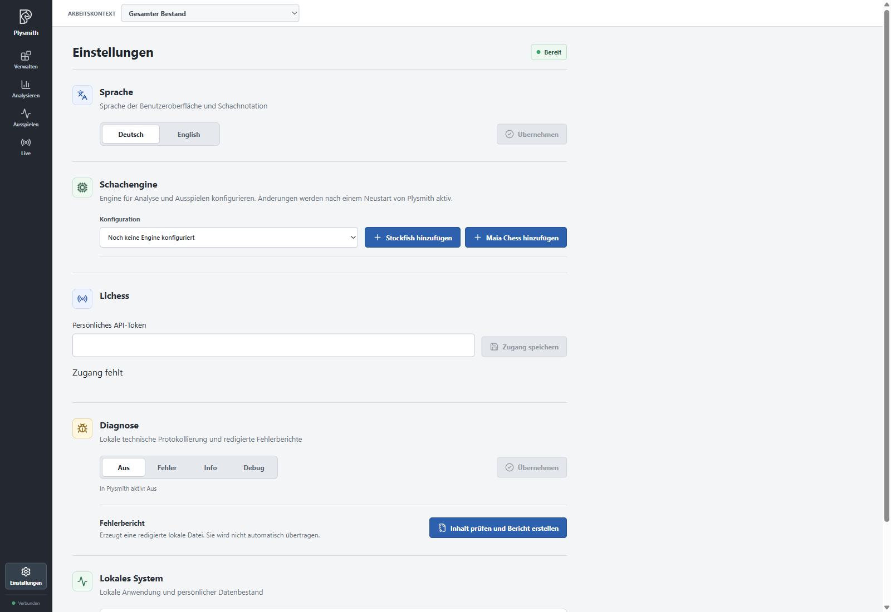
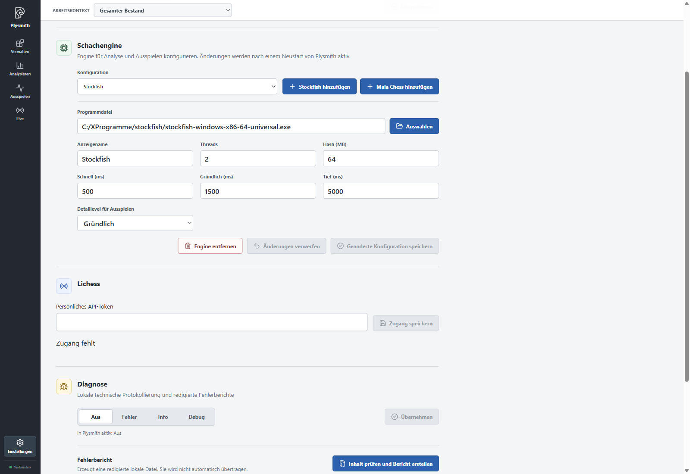
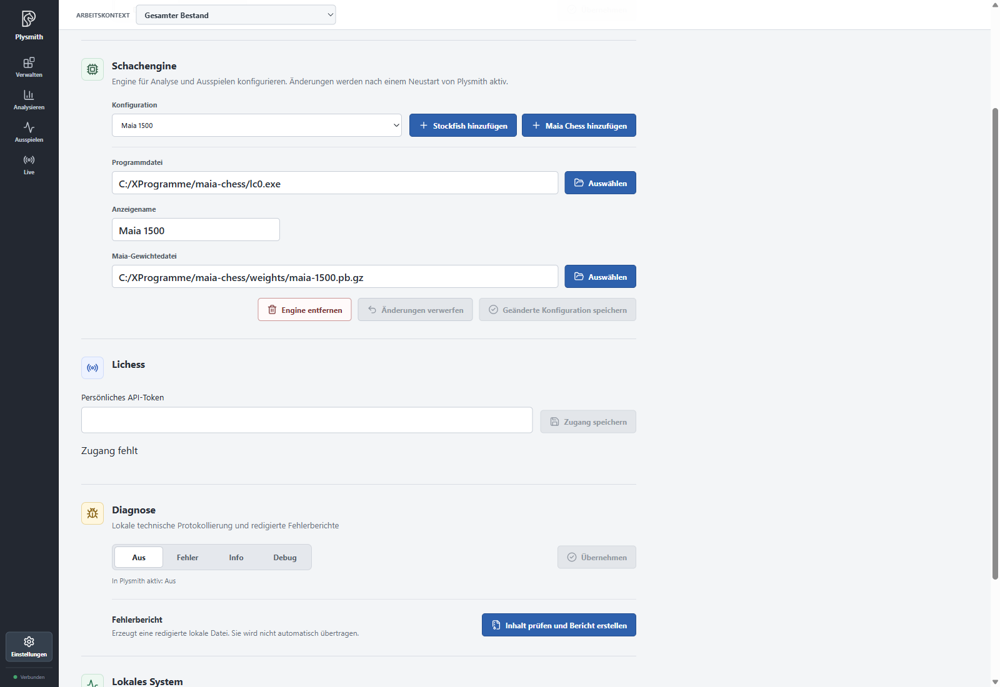
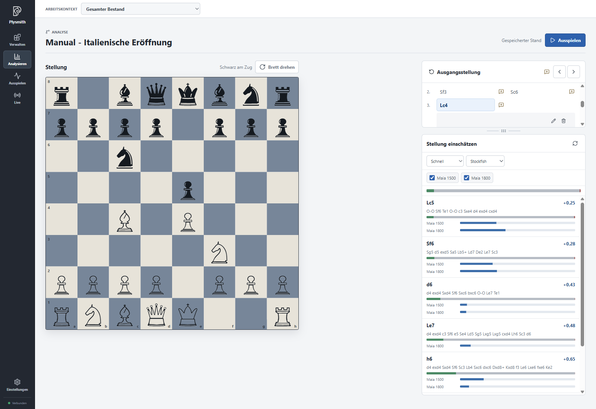
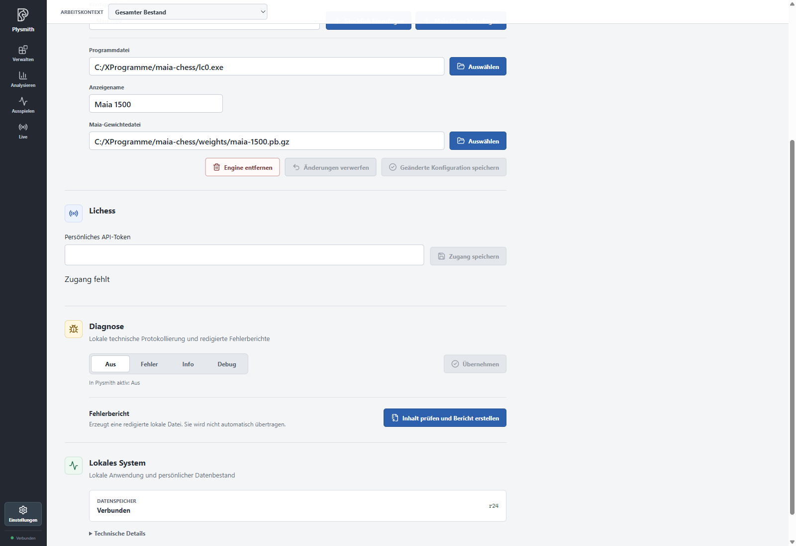
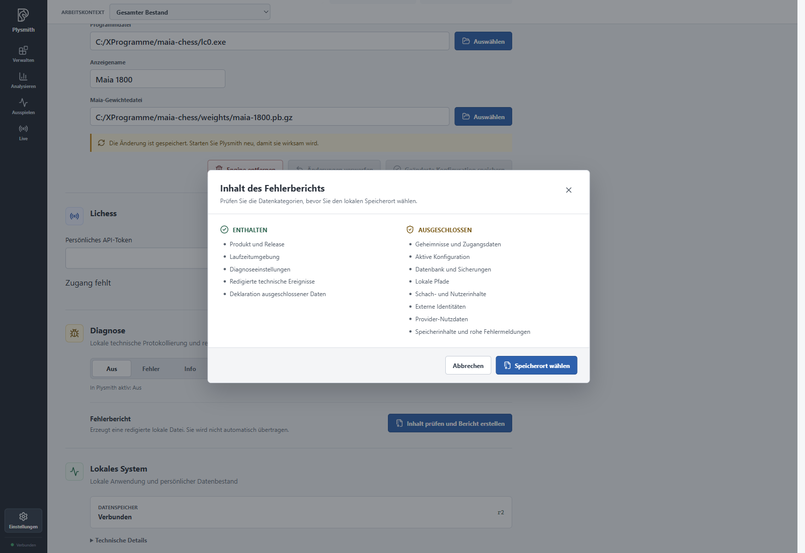

# Settings and engines

So far, you have investigated continuations yourself. An engine adds to your own thinking: Stockfish evaluates positions and searches for good moves, while Maia shows likely human moves for a chosen profile. Both can also serve as opponents when playing out a position.

> The screenshots retain the real German interface. Instructions use the English UI labels; for example, **Schnell / Gründlich / Tief** correspond to **Fast / Thorough / Deep**. See the [language and notation note](README.en.md).

## Language and data

Under **Settings > Language**, choose **Deutsch** or **English** and click **Apply**. This choice affects the interface and chess notation. It does not translate your own names or note text.

A standard installation keeps your personal data folder at `%LOCALAPPDATA%\Plysmith`, separate from the program. Settings currently offers no choice of a different data path. To make a backup, close Plysmith and copy the entire data folder to a safe location. A diagnostic report does not replace this backup.

Under **Local system**, you can see whether the **Data store** is connected. **Technical details** includes the release, which you can include when reporting a problem.

## Setting up Stockfish

You need an extracted Stockfish executable for your computer. Keep engine files in a permanent location outside the Plysmith installation folder. Do not move them while Plysmith uses them. Engines and model weights are not included in the installer; you can configure Stockfish and Maia independently.

The project overview lists [download sources for Stockfish, Lc0 and Maia](../../README.en.md#setting-up-chess-engines).

1. Open **Settings > Chess engine** and choose **Add Stockfish**.
2. Use **Choose** next to **Executable** to select the Stockfish file.
3. Check the **Display name** and suggested values.
4. Click **Save changed configuration**, then restart Plysmith.

The three detail levels initially use these calculation times:

| Detail level | Calculation time | Use                                               |
| ------------ | ---------------: | ------------------------------------------------- |
| Fast         |           500 ms | A first impression while browsing positions       |
| Thorough     |         1,500 ms | A closer look with a short wait                   |
| Deep         |         5,000 ms | A longer investigation of an interesting position |

All three use the configured number of **Threads**, initially **2**. **Hash (MB)** sets the memory available for search results; the suggested value is **64 MB**. You can keep these values to begin with. More calculation time allows a longer search but guarantees neither a particular playing strength nor an error-free evaluation.

Under **Playout detail level**, choose which of these calculation times Stockfish receives as an opponent. The default is **Thorough**. Calculation time in the analysis area is chosen independently.

Later, use **Configuration** to select and edit an existing engine. **Discard changes** reverts your unsaved input. **Remove engine** removes the configuration from Plysmith; the external executable remains. Observe the restart notice shown for each change.

## Setting up Maia

Maia requires two files: the extracted `lc0.exe` executable and a classic Maia weights file in `.pb.gz` format. Leave the weights file compressed. It contains the model; it is not an executable.

Choose **Add Maia Chess**, assign the **Executable** and **Maia weights file**, and enter a suitable **Display name**, such as "Maia 1500". Save the configuration and restart Plysmith. For additional profiles, create further configurations with their respective weights files. They can share the same Lc0 executable.

The weights file determines the profile, not its name. Renaming "Maia 1500" to "Maia 1900" therefore does not change the model. The number denotes the training profile and does not guarantee the opponent's playing strength. During playout, Maia chooses the move the model considers most likely. The three Stockfish detail levels do not apply to Maia.

## Assess position

Open "Manual - Italienische Eröffnung" in **Analyse** and select a position, for example after 3.Bc4. All results under **Assess position** refer to the position currently shown on the board.

Choose **Fast**, **Thorough** or **Deep**. If you have configured multiple Stockfish instances, you can also choose between them. Use the checkboxes to enable individual Maia profiles. Plysmith remembers calculation time, engine selection, Maia selection and sorting across restarts.

Each row begins with a suggested move. Its Stockfish evaluation appears on the right, with Stockfish's expected continuation below where available. Here is how to read the display:

| Display                   | Meaning                                                                |
| ------------------------- | ---------------------------------------------------------------------- |
| `+0.50`                   | Advantage for White, expressed in pawn units                           |
| `-0.50`                   | Advantage for Black                                                    |
| `#3` / `#-3`              | Stockfish reports mate in three moves for White or Black, respectively |
| `≥` or `≤` before a value | The engine knows a bound here, not an exact value                      |
| Green, grey and red bar   | Estimated proportions for a White win, draw and Black win              |
| Blue Maia bar             | Probability with which that model expects this move                    |

The evaluation is always from **White**'s perspective, even when Black is to move or you flip the board. A positive value is neither a win probability nor a guaranteed material gain. The outcome bars are also model estimates. The wide bar above the list belongs to the current position; the small outcome bars belong to the respective continuations. Hover over a bar to see its percentages.

Maia shows at most the five preferred moves for each profile. With multiple profiles, identical moves are combined into one row. If a Maia bar is missing there, the move is not among that profile's displayed suggestions; this means neither zero probability nor automatically a mistake. The visible Maia bars do not have to add up to 100 percent.

**Sort by** determines the order. The selector is to the right of the detail level and appears once at least one Maia profile is selected. With only one Stockfish configuration, the **Stockfish** shown there in the screenshot denotes sorting, not engine selection. **Stockfish** puts suggestions that are better for the side to move at the top. With Black to move, this can mean more negative displayed values appear first. A Maia profile sorts by its move probability. Sorting does not change any saved moves.

The suggestions are ideas for your investigation. To try a move, make it on the board. Only your subsequent decision to apply or save the analysis path keeps it. An engine calculation alone creates neither variations nor new inventory entries.

The message **The evaluation does not know the complete game history.** can appear, for example, for a position you set up yourself. Plysmith cannot recover its missing history from the position. After an engine error, use the **Try again** refresh icon. If an engine is missing entirely, check its configuration and the required restart.

## Lichess access

Under **Settings > Lichess**, enter a **Personal API token** from your Lichess account with the `board:play` permission, labelled "Play games with the board API" on Lichess. Do not use your Lichess password for this.

Create it on the Lichess [Create a personal API access token](https://lichess.org/account/oauth/token) page. Sign in there with your account, enter a description such as "Plysmith" and select that permission. Then enter the generated token in Plysmith; do not share it with others.

Click **Save access** and restart Plysmith. The token is stored locally and is not shown again afterwards. An empty input field therefore does not mean access is missing; the **Access configured** indicator is what matters.

You can save a new token through the same field. There is currently no button to delete the token. You can revoke it in your Lichess account. If you simply do not want a connection, switch **Live** to **Offline**. The saved **Online** or **Offline** choice also determines behaviour at the next start. [Live on Lichess](06-live.en.md) explains the actual workflow.

## Diagnostics and fresh configuration

Under **Diagnostics**, choose **Off**, **Errors**, **Info** or **Debug** and confirm with **Apply**. These levels record progressively more technical events. Observe the restart notice and the **Active in Plysmith** line. For a reproducible problem, for example, choose **Info**, restart and repeat the affected steps.

**Review contents and create report** shows which categories of data the diagnostic report includes and excludes. Use **Choose destination** to save the file yourself. Plysmith does not upload it automatically. Check a report and any accompanying screenshots for personal content before sharing them.

[Reporting Bugs and Ideas](../../README.en.md#reporting-bugs-and-ideas) explains where to report a problem and which details help.

If the saved technical configuration is invalid or no longer supported at startup, Plysmith creates a completely fresh configuration without retaining individual parts of the old one. You must then configure any engines you want to use again. The inventory database is not deleted. The default data store is reopened if its data format is supported. With an incompatible data format, Plysmith cannot start; the data remains untouched. A previously customised data path is not retained, but the file at that location remains. An incorrect or revoked Lichess token, by contrast, is initially an access error.

[Back to overview](README.en.md). Next: [Playing out positions](05-playout.en.md).
