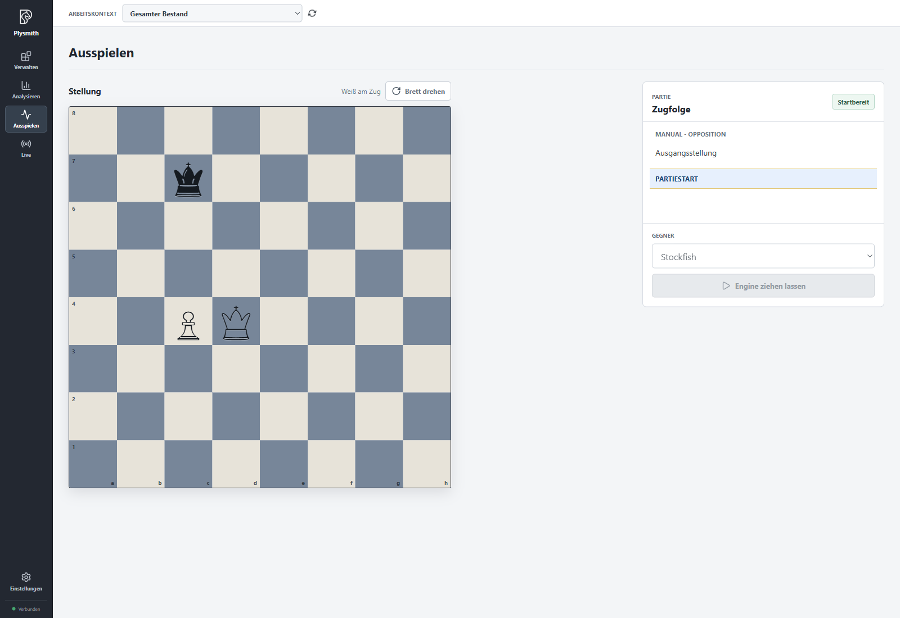
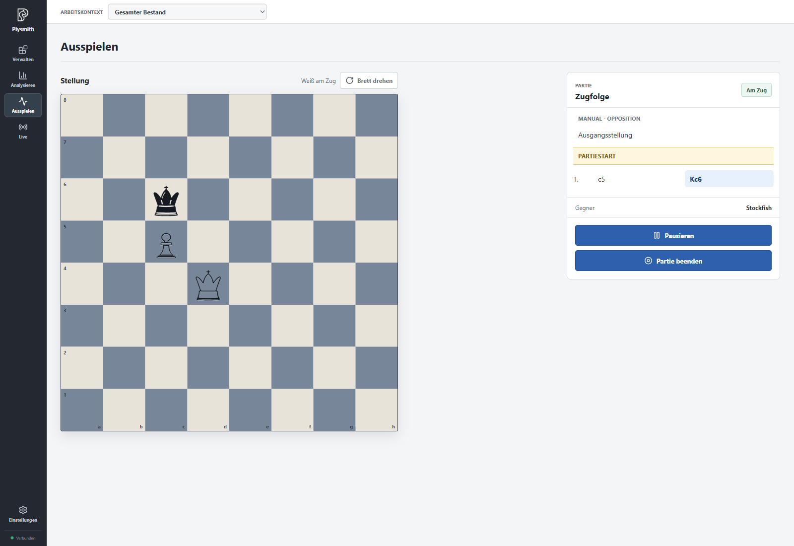
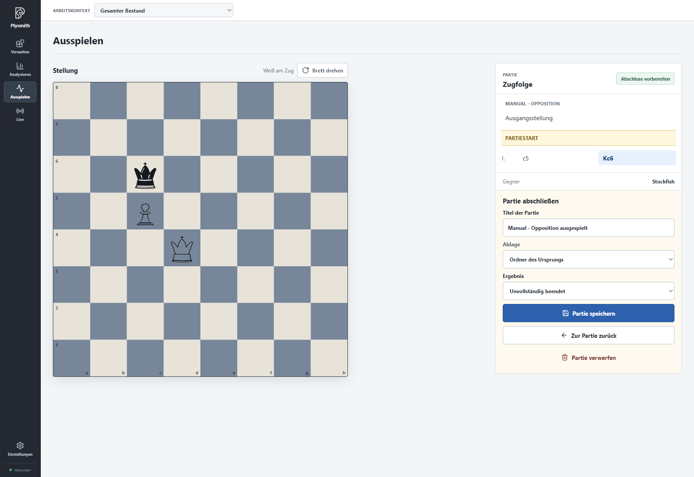

# Playing out positions

Playing out a position lets you test it against an engine. For example, you can explore whether ideas from an endgame analysis help you at the board. Only after the game do you decide whether this attempt belongs in your inventory.

First configure an engine as described in [Settings and engines](04-settings.en.md). For the following example, Stockfish with **Thorough** as its **Playout detail level** is sufficient.

> The screenshots retain the German interface. **Ausspielen** corresponds to **Play out**; the instructions use English controls. See the [language and notation note](README.en.md).

## Starting from an interesting position

Open "Manual - Opposition" in **Analyse** and choose **Play out**. Alternatively, first click a half-move in another game or analysis and begin from the resulting position.

Under **Opponent**, select the engine you want. Who makes the first move determines your colour:

- If you make a move yourself, you play the side whose turn it is in the starting position. In our example, that is White.
- With **Let engine move**, the engine takes that side; you play the other colour.

**Flip board** changes only the view, not your colour. Before starting, you can inspect the displayed source move sequence; select **Game start** again to begin. The marker separates the preceding moves from the original entry from those of your attempt. Our Opposition example has no moves, so there are no preceding moves here yet.

For a game from the normal initial position, you can also choose **New game** in **Manage**. An existing game in progress is not silently replaced: Plysmith asks before discarding it and starting again.

## Playing and pausing

At **Your move**, you can play. During **Engine to move**, wait for its reply. The board always shows the current game position; you cannot jump back to earlier moves in an ongoing or paused game.

Use **Pause** to interrupt the attempt and **Continue** to resume it. If the engine cannot provide a move, **Retry engine move** offers another attempt. Check the engine configuration if problems persist.

**Stop game** opens the completion step. This is not an automatic resignation and does not yet decide a winner. You can now click through the moves to review them. **Return to game** takes you back to the game when completion was prepared manually.

## Saving or discarding

Under **Complete game**, enter a **Game title**, for example "Manual - Opposition ausgespielt", and choose the **Location**. For an attempt started from an inventory entry, **Origin folder** uses that entry's folder. Like every inventory name, the title must be unique.

If the game has reached a position where the rules determine its result, Plysmith displays that result. When ending manually, choose for yourself: White wins, Black wins, Draw or **Stopped unfinished**. If you have only tried a few moves, **Stopped unfinished** is appropriate.

**Save game** adds your attempt to the inventory as a new game. The original entry is not changed. The starting point and source move sequence remain traceable; you can then analyse the saved game moves and add notes to them.

**Discard game** ends the attempt without a new inventory entry. Try both options: save an instructive attempt and discard a second one that taught you nothing new. This keeps your inventory a deliberate selection.

[Back to overview](README.en.md). Next: [Live on Lichess](06-live.en.md).
