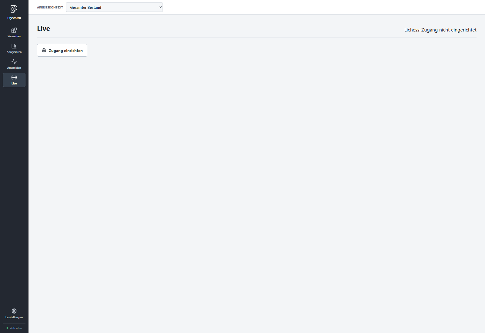

# Live auf Lichess

Mit **Live** übernehmen Sie eine Lichess-Partie zum Spielen oder Zuschauen in Plysmith. Gegnersuche und Partiestart bleiben im Browser. Interessante Partien können Sie nach ihrem Ende in Ihren persönlichen Bestand übernehmen.

## Verbinden

Richten Sie zunächst unter **Einstellungen > Lichess** Ihren [persönlichen Zugang](04-settings.md#lichess-zugang) ein und starten Sie Plysmith neu. Stellen Sie anschließend den Schalter in **Live** auf **Online**.

Das Bild zeigt den Zustand vor der Zugangseinrichtung. Nach dem Speichern des Tokens und dem Neustart erscheint hier der Online-/Offline-Schalter.

Die erste Einstellung ist **Offline**. Plysmith merkt sich Ihre Wahl: Haben Sie bewusst **Online** gewählt, versucht die App beim nächsten Start wieder zu verbinden. Bei bestehender Verbindung erkennt Plysmith eigene Partiestarts auch dann, wenn Sie gerade einen anderen Bereich der App geöffnet haben.

**Offline** trennt die Verbindung. Es beendet keine Partie auf Lichess und verwirft keine bereits geöffnete Aufnahme. Beim erneuten Verbinden wird deren Stand abgeglichen. Eine lokale Live-Aufnahme wird jedoch nicht über einen Neustart von Plysmith hinweg wiederhergestellt. Speichern Sie eine abgeschlossene Partie deshalb vor dem Schließen.

## Im Browser beginnen, in Plysmith spielen

1. Bleiben Sie in Plysmith **Online** und starten Sie im Lichess-Browser eine Partie mit normalen Schachregeln.
2. In **Live** erscheint **Laufende Lichess-Partie**. Neben dem Namen sehen Sie auch die von Lichess für diese Partie übermittelte Wertungszahl, sofern vorhanden.
3. Wählen Sie **Hier spielen** und führen Sie Ihre Züge auf dem Brett aus.

Nicht jede Lichess-Partie kann über die Board API gespielt werden. Wenn Plysmith **Diese Partie kann nur auf Lichess gespielt werden** meldet, setzen Sie die Partie im Browser fort. Schachvarianten wie Chess960 werden nicht unterstützt.

Während einer eigenen laufenden Onlinepartie ist Analysehilfe in ganz Plysmith gesperrt, auch wenn Sie die Partie im Browser spielen. Das betrifft auch Maia und lokale Enginepartien. Offline zu gehen oder Plysmith neu zu starten hebt eine bereits festgestellte Sperre nicht auf; Plysmith muss das Ende bei Lichess bestätigen können.

Die Uhr zählt zwischen den Zeitmeldungen lokal weiter und wird mit neuen Meldungen korrigiert. **Geschätzte Restzeit** kennzeichnet diese Anzeige. Bei unterbrochener Verbindung sehen Sie die **Zuletzt übermittelte Restzeit**. Entscheidend für eine Zeitüberschreitung ist das von Lichess bestätigte Ergebnis, nicht allein eine lokal angezeigte Null.

Mit **Aufgeben** können Sie die Partie nach Bestätigung beenden. **Remis anbieten**, **Remis annehmen** und **Remis ablehnen** stehen passend zum Partiestand zur Verfügung. Ganz am Anfang kann **Partie abbrechen** angeboten werden. Ein Zurückblättern ist während Ihrer eigenen laufenden Partie nicht möglich.

## Zuschauen und einschätzen

Öffnen Sie eine fremde Partie auf Lichess, kopieren Sie ihre Adresse und tragen Sie sie in **Lichess-Partie-URL** ein. Wählen Sie **Zuschauen**. Plysmith erkennt nicht automatisch, welche Partie Sie in einem Browser-Tab betrachten.

Plysmith übernimmt die bereits gespielten Züge und ergänzt den weiteren Verlauf. Die Zuschauerübertragung von Lichess ist verzögert; sie ist deshalb nicht immer gleichauf mit dem Browser. Während der Aufnahme können Sie frühere Züge anklicken oder mit den Pfeilen durchgehen. Die Aufnahme läuft dabei weiter.

Unter **Stellung einschätzen** sehen Sie die eingerichteten Engines für die jeweils angezeigte Stellung. Bewertungen, Ergebnisbalken und Maia-Vorschläge lesen Sie wie im Kapitel [Einstellungen und Engines](04-settings.md#stellung-einschätzen). Während einer eigenen laufenden Onlinepartie steht auch dieser Weg zur Enginehilfe nicht zur Verfügung.

## Ergebnis übernehmen

Nach dem Ende gleicht Plysmith die letzten Züge und das Ergebnis ab. Solange **Partie wird vervollständigt** erscheint, ist dieser Schritt noch nicht abgeschlossen. Sobald **Partie beendet** angezeigt wird, können Sie einen eindeutigen Namen und eine Ablage wählen und **Partie speichern**.

Die gespeicherte Partie enthält den vollständigen aufgezeichneten Verlauf. Spielernamen, Ergebnis und Lichess-Adresse werden als bearbeitbare Notiz übernommen. Möchten Sie die Partie nicht behalten, wählen Sie **Aufzeichnung verwerfen**. Das entfernt nur die Aufnahme in Plysmith und beendet keine noch laufende Partie auf Lichess. Auch beim Verlassen einer offenen Aufnahme verlangt Plysmith eine entsprechende Entscheidung.

Bei einem Verbindungsabbruch versucht Plysmith, die Verbindung wiederherzustellen. Falls nötig, verwenden Sie **Verbindung aktualisieren**. Das gilt auch, wenn das Ergebnis noch fehlt und die Partie sich deshalb nicht speichern lässt. Bei **Zugbestätigung ausstehend** warten Sie den Abgleich ab, bevor Sie weiterziehen. Meldet Lichess, dass derzeit keine weitere Anfrage erlaubt ist, versuchen Sie es später erneut.

[Zur Übersicht](README.md) · Weiter mit [Eine Eröffnungsbibliothek aufbauen](07-opening-library.md).
