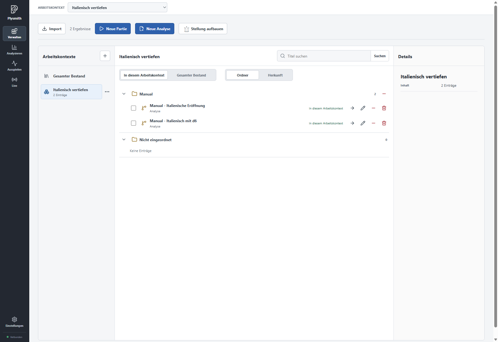
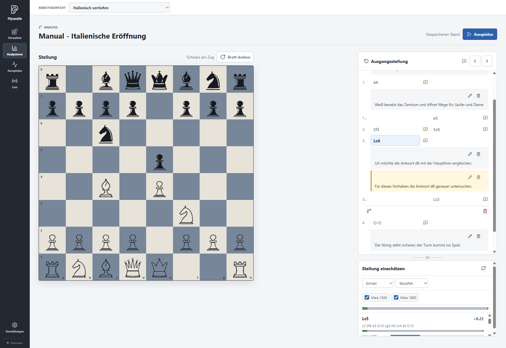
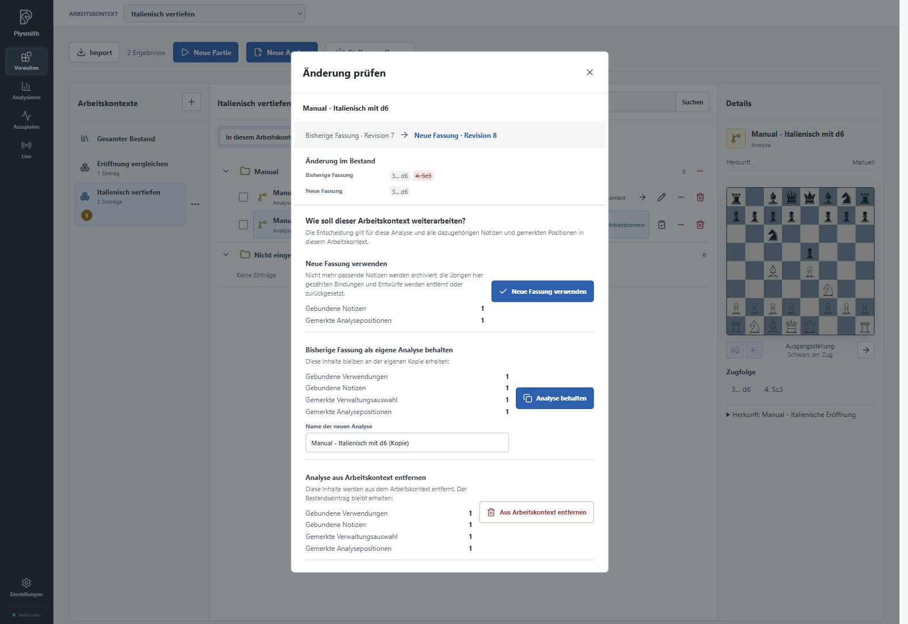

# Mit Arbeitskontexten parallel arbeiten

Ihr Bestand bleibt Ihre persönliche, bewusst ausgewählte Sammlung. Mit **Arbeitskontexten** können Sie darin mehrere Themen parallel bearbeiten, etwa „Italienisch vertiefen“ und „Endspieltraining“. Jeder Kontext stellt die passenden Einträge und Ihre Arbeit daran zusammen. Sie verbessern damit denselben Bestand und passen ihn an Ihre Bedürfnisse an.

## Einen Kontext zusammenstellen

Legen Sie in **Verwalten** über das Plus bei **Arbeitskontexte** einen Kontext an. Ein Name wie „Italienisch vertiefen“ genügt. Über **Arbeitskontext bearbeiten** können Sie später eine **Beschreibung** ergänzen, die Ihr Vorhaben festhält.

Wählen Sie im aktiven Kontext die Ansicht **Gesamter Bestand**, suchen Sie „Manual - Italienische Eröffnung“ und nehmen Sie den Eintrag mit **Im Arbeitskontext verwenden** auf. Mehrere markierte Einträge lassen sich mit **Auswahl in Arbeitskontext aufnehmen** gemeinsam hinzufügen.

Die beiden Auswahlen haben unterschiedliche Aufgaben:

| Auswahl                                                               | Wirkung                                                                                       |
| --------------------------------------------------------------------- | --------------------------------------------------------------------------------------------- |
| Oben **Arbeitskontext**                                               | Wechselt zwischen einem benannten Kontext und **Gesamter Bestand** als eigenem Arbeitsbereich |
| In **Verwalten**: **In diesem Arbeitskontext** / **Gesamter Bestand** | Zeigt innerhalb des aktiven Kontexts dessen Einträge oder zusätzlich den übrigen Bestand      |
| **Ordner** / **Herkunft**                                             | Ordnet die sichtbaren Einträge nach Ablage oder tatsächlicher Entstehung                      |

Die Bestandsansicht innerhalb eines Kontexts hilft Ihnen, weiteres Material zu finden. Sie wechselt nicht den aktiven Arbeitsbereich. Einträge außerhalb des Kontexts können Sie ansehen. Um einen solchen Eintrag hier zum Analysieren zu öffnen, nehmen Sie ihn zuerst auf oder wechseln oben zu **Gesamter Bestand**. Verwaltungsaktionen wie Umbenennen oder Löschen wirken dagegen auch hier auf den gemeinsamen Bestand.

Die Aufnahme erstellt keine Kopie. Derselbe Eintrag kann in mehreren Kontexten verwendet werden, behält aber seinen eindeutigen Bestandsnamen und seine gemeinsame Ordnerablage.

Plysmith merkt sich die gewählte Ansicht **Ordner** oder **Herkunft** für den
Gesamten Bestand und jeden Arbeitskontext getrennt, auch nach einem Neustart.

## Ordner als Arbeitsziele

Mit **Ordner in Arbeitskontext aufnehmen** übernehmen Sie einen Ordner und seine aktuellen Unterordner als Ablageziele. Dabei können Sie **Auch die aktuellen Einträge in diesen Ordnern aufnehmen** wählen. Ohne diese Auswahl wird der Kontext durch den Ordner allein nicht mit dessen Inhalten gefüllt.

Spätere Einträge und neue Unterordner kommen nicht automatisch hinzu. Sie entscheiden ausdrücklich, was zum Thema gehört. Beim Speichern oder Verschieben in einem Kontext stehen die dafür verfügbaren Ordner zur Wahl. **Nicht eingeordnet** bleibt ebenfalls eine mögliche Ablage. Ein Verschieben ändert den Ordner des gemeinsamen Bestandseintrags, auch wenn Sie die Aktion aus einem Kontext heraus ausführen.

## Eigene Notizen und Arbeitsstände

Öffnen Sie die italienische Analyse im Kontext „Italienisch vertiefen“. Ihre gespeicherten Züge und allgemeinen Notizen sind dieselben wie im Bestand. Ergänzen Sie nun an einem Halbzug eine Notiz und achten Sie auf deren Geltung:

- **Nur in Italienisch vertiefen** hält beispielsweise eine Frage für dieses Vorhaben fest. Die Auswahl nennt Ihren aktiven Kontext. Die Notiz erscheint nicht in Ihren anderen Kontexten.
- **Allgemein** ergänzt den gemeinsam verwendeten Eintrag und ist auch außerhalb dieses Kontexts sichtbar.

Allgemeine Notizen erscheinen auf grauem Hintergrund, Kontextnotizen auf gelblichem Hintergrund mit einer goldfarbenen Linie. Beim Bearbeiten sehen Sie ausdrücklich, ob die Notiz **Allgemein** oder **Nur in diesem Arbeitskontext** gilt. Eine allgemeine Notiz bleibt allgemein, auch wenn Sie sie aus einem Kontext heraus bearbeiten.

Analysepfade und gemerkte Analysepositionen sind je Arbeitsbereich getrennt. Sie können in „Italienisch vertiefen“ einen vorläufigen Pfad beginnen, in einem anderen Kontext weiterarbeiten und später zu Ihrer Untersuchung zurückkehren. Plysmith merkt sich Analysepfade auch über einen Neustart. Das ist weiterhin ein Entwurf, keine gespeicherte Variante und kein neuer Eintrag.

Wenn beim Öffnen eines anderen Eintrags bereits ein Analyseentwurf im Weg steht, bietet Plysmith **Vorhandene Analyse fortsetzen** oder **Entwurf verwerfen und Eintrag öffnen** an. Verwerfen Sie ihn nur, wenn Sie die Untersuchung nicht mehr benötigen.

Eine neue eigene Analyse oder eine neue Partie, die Sie aus einem Kontext heraus speichern, wird Teil des Bestands. Für eine eigene Analyse wählen Sie als **Speicherziel** entweder **Nur Bestand** oder **Bestand + Italienisch vertiefen**, wobei die zweite Option Ihren aktiven Kontext nennt. Beim Speichern einer Partie aus **Ausspielen** entscheiden Sie mit **Zusätzlich in diesem Arbeitskontext verwenden** über ihre Aufnahme in das aktuelle Thema. Eine in **Live** gespeicherte Partie wird automatisch auch im aktiven Arbeitskontext verwendet.

## Gemeinsame Züge bewusst verändern

Eine gespeicherte Variante und Änderungen an der Hauptlinie gehören zum Bestandseintrag. Sie gelten nicht nur für den Kontext, in dem Sie gearbeitet haben. Andere Kontexte können deshalb betroffen sein, insbesondere wenn dort Notizen oder ungespeicherte Untersuchungen an entfallenden Zügen hängen.

Prüfen Sie vor **Speichern** die Gegenüberstellung **Bisherige Fassung** und **Neue Fassung**. Sie zeigt, welche Züge erhalten bleiben, hinzukommen oder entfallen. Falls Plysmith **Beim Speichern entfallen Kontextinhalte** meldet, nennt es auch die betroffenen Notizen und ungespeicherten Analysen. Diese Folgen werden bereits mit dem Speichern angewendet. Ein Kontextwechsel allein schützt nicht vor solchen Änderungen am gemeinsamen Eintrag.

Für andere betroffene Kontexte kann stattdessen **Neue Fassung verfügbar** erscheinen. Über **Änderung prüfen** öffnen Sie den Vergleich und entscheiden, wie der Kontext weiterarbeiten soll. Bis zur Entscheidung verwendet dieser Kontext noch die bisherige Fassung. Sie haben drei Möglichkeiten:

| Entscheidung                                      | Wirkung                                                                                                                        |
| ------------------------------------------------- | ------------------------------------------------------------------------------------------------------------------------------ |
| **Neue Fassung verwenden**                        | Wechselt auf den geänderten Eintrag. Prüfen Sie die angezeigten Folgen für Notizen, Entwürfe und gemerkte Positionen.          |
| **Bisherige Fassung als eigene Analyse behalten** | Legt unter einem neuen, eindeutigen Namen tatsächlich eine eigene Analyse an und führt die kontextbezogene Arbeit dort weiter. |
| **Analyse aus Arbeitskontext entfernen**          | Entfernt die Verwendung und die dazugehörige Kontextarbeit. Der Bestandseintrag bleibt erhalten.                               |

Bei der Übernahme einer neuen Fassung werden nicht mehr passende Notizen archiviert; weitere betroffene Arbeitsstände können entfernt oder zurückgesetzt werden. Die angezeigte Vorschau benennt die Folgen Ihrer Wahl. Bei einem Verlust müssen Sie die Entscheidung zusätzlich bestätigen.

Das Bild können Sie an Ihrer Arbeitsanalyse nachvollziehen: Nehmen Sie „Manual - Italienisch mit d6“ zusätzlich in einen zweiten Kontext „Eröffnung vergleichen“ auf. Ergänzen Sie in „Italienisch vertiefen“ eine Kontextnotiz an **4.Sc3**, etwa „Diese Fortsetzung im nächsten Training ausspielen.“ Wechseln Sie oben zu **Gesamter Bestand** und kürzen Sie die Arbeitsanalyse um ihren letzten Hauptlinienzug **4.Sc3**. Prüfen Sie die Folgen und speichern Sie.

Zurück in „Italienisch vertiefen“ müssen Sie nun entscheiden, wie dieses Thema mit der neuen Fassung weiterarbeiten soll. Die importierte italienische Eröffnung bleibt unverändert. Wird eine Analyse dagegen nur in einem einzigen Arbeitskontext verwendet, kann dieser bereits beim Speichern auf die neue Fassung wechseln; die Vorschau nennt auch dann die Folgen.

Die eigene Analyse ist hier eine bewusste Kopie. Sie entsteht erst durch diese Entscheidung, nicht schon beim Anlegen eines Arbeitskontexts. Die Kontextnotizen und Arbeitsstände werden an der Kopie weitergeführt. Allgemeine Notizen bleiben beim ursprünglichen Eintrag und werden nicht mitkopiert. Im aktuellen Kontext wird anschließend die Kopie verwendet.

## Ein Thema abschließen oder aufräumen

**Aus Arbeitskontext entfernen** löst nur die Verwendung in diesem Kontext. Dabei gehen dessen gebundene Notizen und Arbeitsstände verloren; der Eintrag selbst und andere Kontexte bleiben erhalten. Entsprechend entfernt **Arbeitskontext löschen** das gesamte Thema samt eigener Kontextarbeit, aber nicht die Bestandseinträge.

**Aus Bestand löschen** wirkt weiter: Der Eintrag verschwindet mit seinen Verwendungen und gebundenen Inhalten. Prüfen Sie deshalb die Verlustvorschau, bevor Sie bestätigen. Ein Ordner lässt sich ebenfalls aus einem Kontext entfernen; dessen betroffene Kontextarbeit wird dabei mit angezeigt. Das Löschen eines Ordners aus dem Bestand lässt dagegen seine Einträge unter **Nicht eingeordnet** erhalten.

Übernehmen Sie zum Abschluss die Erkenntnisse, die dauerhaft zu Ihrem Schachspiel gehören: als allgemeine Notizen, bewusst gespeicherte Fortsetzungen oder eigene Analysen. Der Arbeitskontext hat dann seinen Zweck erfüllt, indem er Ihnen geholfen hat, Ihre persönliche Sammlung weiterzuentwickeln.

[Zur Übersicht](README.md).
