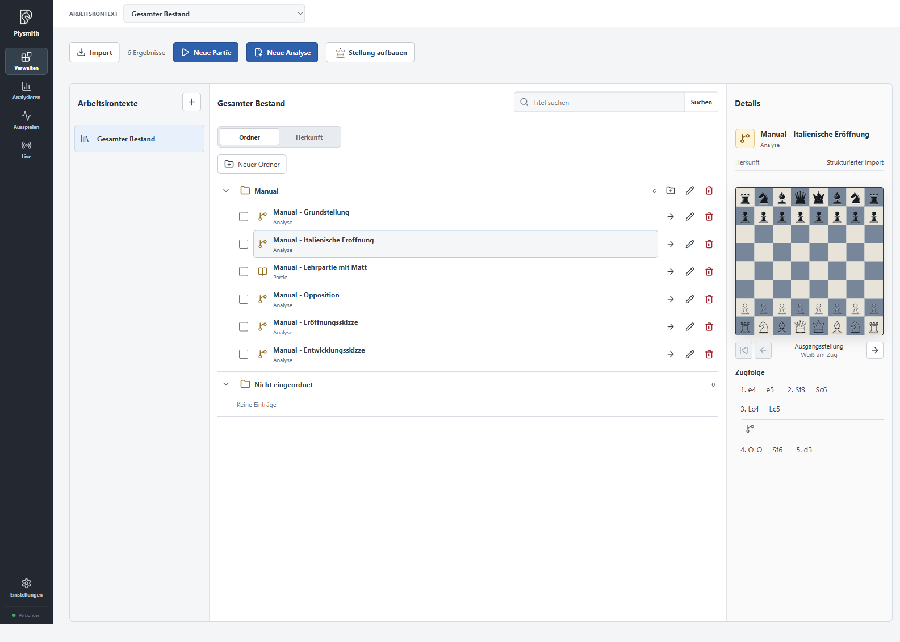
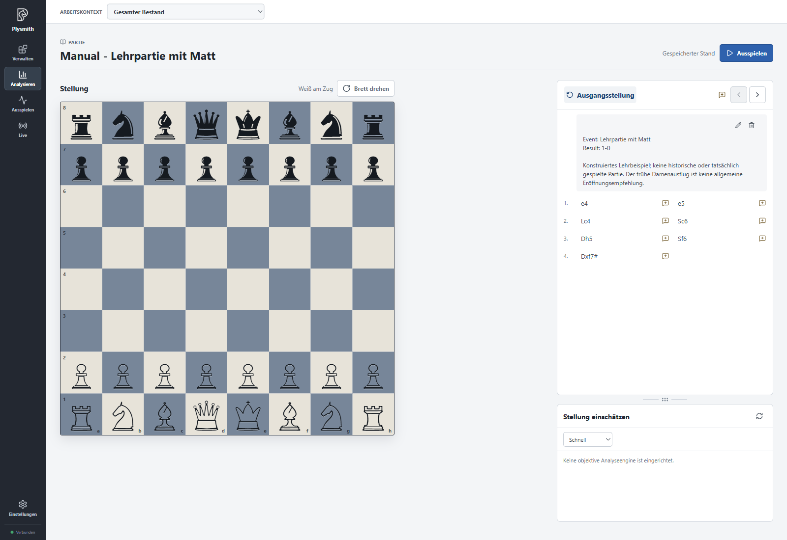
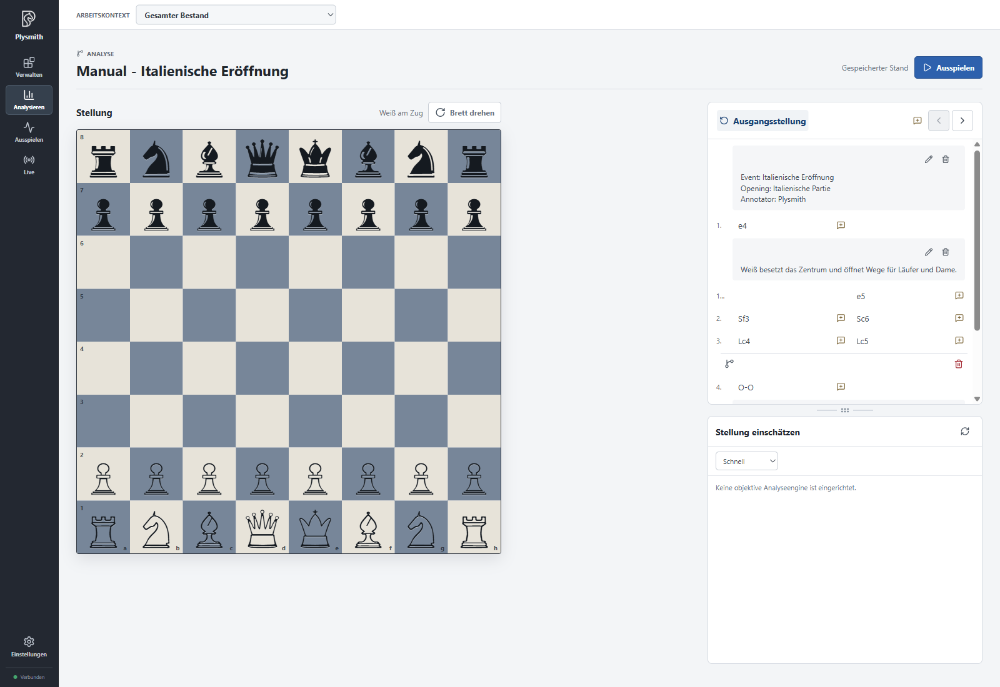
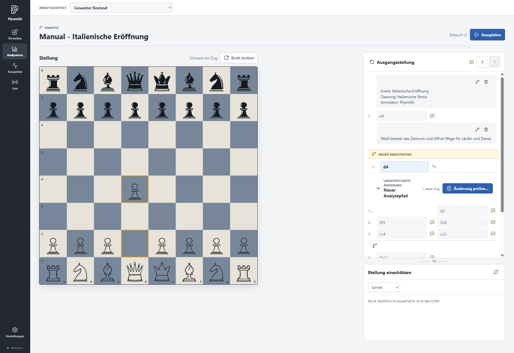

# Plysmith Basics

Plysmith lets you focus on the chess topics that matter to you: try continuations, have positions and continuations evaluated, and record your own thoughts. Choose the games and analyses that are relevant to your own chess.

Throughout this manual, we use a small [sample collection in PGN format](manual.pgn). The screenshots and exercises are based on this material. You can import it and follow the steps yourself. The collection includes an Italian opening, an endgame position and a short, constructed teaching game ending in checkmate. The teaching game is neither historical nor actually played, and it is not an opening recommendation.

> The screenshots show the real German interface. Instructions use the English UI labels: for example, **Verwalten** is **Manage**, **Analysieren** is **Analyse**, **Gesamter Bestand** is **All inventory**, and **Herkunft** is **Origins**. The PGN's German titles and notes remain unchanged so you can find the same examples. English notation uses **K/Q/R/B/N** where the German screenshots use **K/D/T/L/S**; for example, **3.Lc4** is **3.Bc4**, and **4.Sc3** is **4.Nc3**. A half-move is one move by either White or Black.

## All inventory

In Plysmith, you manage a central **inventory** of games and analyses. The idea is to build a personal collection around your chess: deliberately selected material for training, tournament preparation and your chess interests. You can develop this material over time with your own notes and analyses.

In **Manage**, you can review this inventory, remove unsuitable material, organise interesting content and explore it further. The **working contexts** introduced later let you work on individual topics in parallel. You continue developing the same personal collection and adapting it to your needs.

The example folder **Manual** contains six entries. The Italian opening is selected; its details and a preview of its move sequence appear on the right.

**Folders** give your inventory a logical structure, for example by topic. They organise the shared collection but do not create independent inventories. An entry belongs to at most one folder. Moving it leaves it as the same game or analysis; no copy is created. Entries without a folder appear under **Unfiled** and are just as much part of the inventory.

The folder structure does not change the requirement that **names must be unique across the entire inventory**. This also applies to entries in different folders or of different types. Changing only the letter case is not enough to distinguish them. The name "Manual - Italienische Eröffnung" is therefore already taken even if you want to put a new entry with that name in another folder.

Unlike folders, an entry's **origin** describes how an analysis was created, rather than its topic. When you derive and save a separate analysis from a game or analysis, Plysmith remembers the original entry and the starting point. This lets you trace where your investigation began. Sharing a folder or being imported from the same file does not establish such a connection.

## Games and analyses

A **game** records what was played, whether you imported it, played it yourself or recorded it while watching. Its saved moves remain unchanged.

An **analysis**, on the other hand, lets you investigate and record continuations from a chosen starting position. It can consist of that position alone, without any saved moves. The sample analysis "Manual - Grundstellung" is therefore already a complete inventory entry.

The header identifies the type with the word **Game** or **Analysis** and its corresponding icon: a book for a game, a branch for an analysis. Opening a game in **Analyse** does not turn it into an analysis.

### What they share

Both begin at a **starting position**. This can be the **initial position** or a position you set up yourself, such as the beginning of an opening variation or an endgame position. The central saved move sequence following this starting position is called the **main line**. In a game, it records the course of play; in an analysis, it records the principal variation you have investigated.

**Notes** can describe a game or analysis as a whole, or refer to a particular half-move. You can add and edit notes. Information from imports is also included as notes.

You can also keep continuations you try on the analysis board. For either type, an **analysis path** can be turned into a note at its starting point. You can then edit the note independently of the analysis path; the main line remains unchanged.

To pursue an investigation separately, you can start a **separate analysis** and save it as a new inventory entry. This is possible from either a game or an analysis: from any half-move or directly from the starting position. Its **origin** preserves the connection to the original entry and starting point. The original entry remains unchanged.

### How they differ

The key difference is how you can edit and extend the main line. In a **game**, the saved moves remain unchanged so they continue to record what was played. Your notes supplement this record without changing any moves.

In an **analysis**, you can extend, replace or shorten the main line. Alternative continuations do not have to replace it: you can also save them as **variations** within the same analysis. A variation can contain further branches of its own.

In this example, 3...Nf6 branches off from the main line with 3...Bc5. Within that variation, 4.Ng5 is an alternative to 4.d3. The branching icons mark both levels. The text about castling, by contrast, is a note about the position.

## Viewing and trying moves

Clicking a move in the move sequence in **Analyse** shows the position after that move on the board. This does not change any saved moves. From that position, you can try a different continuation, including in a game.

Here, 1.d4 has been tried from the initial position. **New analysis path** and **Unsaved change** mark the provisional path. Plysmith retains it temporarily, including across context switches and restarts. This does not automatically make it part of the saved game or analysis, or create a new inventory entry. You decide what to do with it.

## Keeping your investigation

An analysis path does not have to change the saved move sequence. You can turn the path into a **note** and expand on it. Or you can save it as a **separate analysis**, an independent new entry in the inventory.

The screenshot shows an analysis path in a **game**. **Turn path into note** records the continuation as a note at its starting point. You can add to and edit the note. **Save as separate analysis** creates a new entry in which you can pursue the investigation separately. In both cases, the game's saved moves remain unchanged.

In an **analysis**, too, you can turn the path into a note or save it as a separate analysis. You can also choose **Save as variation** to keep the continuation as an alternative within the same analysis. The main line remains in place.

To change the main line instead, you can append a continuation at its end or replace the existing moves from the path's starting point onwards. In the screenshot, this second option is **Replace main line from here**. Variations and changes to the main line remain part of the same analysis; no new inventory entry is created.

**Discard analysis path** ends the provisional investigation without keeping it. The saved entry remains unchanged.

## The origin of a separate analysis

In this example, a separate analysis called "Manual - Italienisch mit d6" was saved from "Manual - Italienische Eröffnung" after 3.Bc4. Its starting position is the position after that half-move.

The blue boundary **Starting position of this analysis** separates the source move sequence from the analysis itself. The preceding moves show how the starting position was reached. They belong to the source and were not copied into the new analysis as its own moves. Its first and so far only move is 3...d6.

The source and the derived analysis are two independent inventory entries. You can develop the new analysis without changing the original entry. Conversely, later changes to the source are not automatically applied to the derived analysis.

## Through the manual

For [installation and updates](../../README.en.md#installation), see the project overview.

The following chapters take you from importing the sample material to your own investigations and practice games. Start in **All inventory**; the final chapter introduces working on topics in parallel with contexts.

1. [Importing the sample collection](01-import.en.md)
2. [Reviewing and organising your inventory](02-inventory.en.md)
3. [Investigating positions and recording your thoughts](03-analysis.en.md)
4. [Settings and engines](04-settings.en.md)
5. [Playing out positions](05-playout.en.md)
6. [Live on Lichess](06-live.en.md)
7. [Building an opening library](07-opening-library.en.md)
8. [Working on topics in parallel with contexts](08-contexts.en.md)

Begin with [Importing the sample collection](01-import.en.md). The constructed teaching game serves only to demonstrate working with a game. The other examples are material to investigate, not ready-made opening recommendations.
